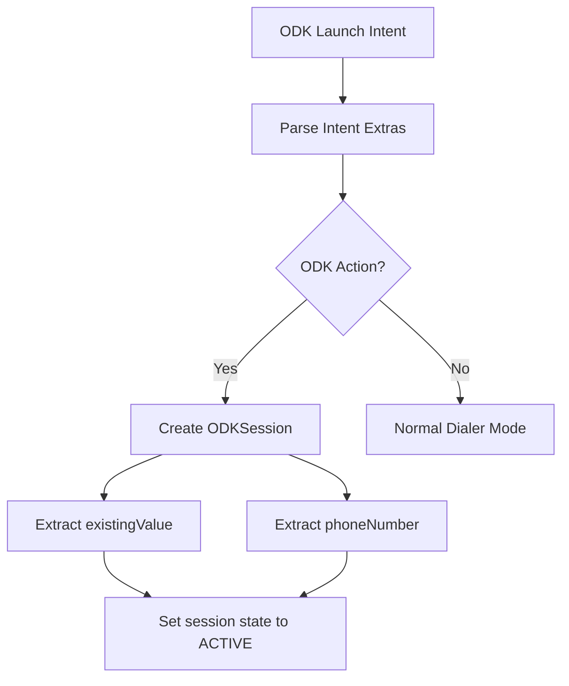
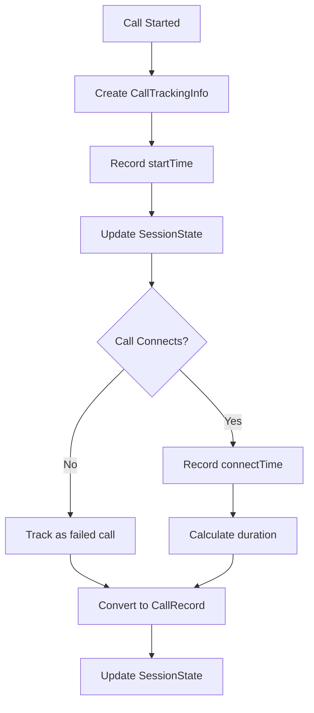
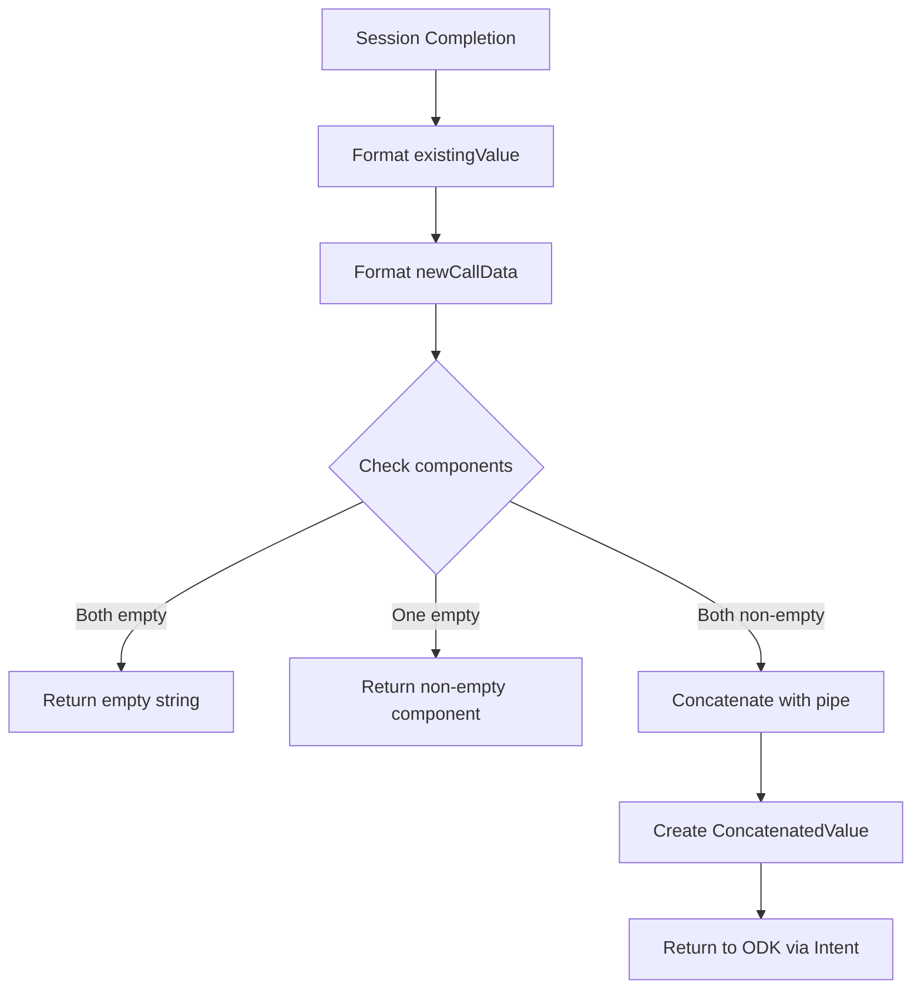

# Data Model: Enhanced ODK Integration with Value Concatenation

**Branch**: `001-odk-value-concat` | **Date**: 2025-11-22

## Overview

This document defines the enhanced data model for the ODK integration feature, building on the existing Fossify Phone architecture to support value concatenation, timestamp recording, and comprehensive call tracking.

## Core Entities

### 1. ODKSession

**Purpose**: Represents an active integration session with ODK Collect, containing session state, existing values, and call tracking data.

**Fields**:
```kotlin
data class ODKSession(
    val isActive: Boolean,
    val phoneNumber: String?,
    val existingValue: String?,          // Value from previous ODK session
    val sessionStartTime: Long,
    val callRecords: List<CallRecord>,
    val activeCalls: Map<Call, CallTrackingInfo>,
    val sessionVariant: BuildVariant    // core, foss, or gplay
)
```

**Relationships**:
- Contains multiple `CallRecord` instances
- Tracks active calls via `Call` object references
- Associated with specific build variant for intent handling

**State Transitions**:
- `INACTIVE` → `ACTIVE` (ODK launch)
- `ACTIVE` → `COMPLETED` (return to ODK)
- `ACTIVE` → `INACTIVE` (session timeout/cancel)

### 2. CallRecord

**Purpose**: Represents individual call attempts made during ODK session, including direction, phone number, duration, and timestamp.

**Fields**:
```kotlin
data class CallRecord(
    val callId: String,                  // Unique call identifier
    val direction: CallDirection,        // INCOMING or OUTGOING
    val phoneNumber: String,             // E.164 formatted phone number
    val duration: Double,                // Call duration in seconds
    val startTime: Long,                 // Call start timestamp (dial time)
    val connectTime: Long?,              // Call connection timestamp (null for failed calls)
    val endTime: Long,                   // Call end timestamp
    val wasSuccessful: Boolean,          // True if call reached active state
    val failureReason: String?,          // Null for successful calls
    val formattedTimestamp: String       // ISO 8601 formatted timestamp
)

enum class CallDirection {
    INCOMING,
    OUTGOING
}
```

**Relationships**:
- Belongs to a single `ODKSession`
- Referenced by parent session's callRecords list
- Associated with zero or one `Call` object during active state

**Validation Rules**:
- `startTime` must be before `endTime`
- `connectTime` must be null or between `startTime` and `endTime`
- `phoneNumber` must be in E.164 format
- `duration` must be ≥ 0

### 3. CallTrackingInfo

**Purpose**: Temporary tracking information for active calls during ODK session.

**Fields**:
```kotlin
data class CallTrackingInfo(
    val call: Call,                      // Android Call object reference
    val startTime: Long,                 // Dial time timestamp
    val connectTime: Long,               // Connection time timestamp (0 if not connected)
    val number: String,                  // Phone number
    val direction: CallDirection,        // Call direction
    val isActive: Boolean,               // Currently active call
    val stateHistory: List<CallState>    // State transition history
)
```

**Relationships**:
- Maps Android `Call` objects to tracking data
- Transitions to `CallRecord` when call ends

**State Management**:
- Created when call starts (`onCallStarted`)
- Updated when call state changes (`onStateChanged`)
- Converted to `CallRecord` when call ends (`onCallEnded`)

### 4. ConcatenatedValue

**Purpose**: The final formatted string returned to ODK Collect, combining existing values and new call records separated by pipes.

**Fields**:
```kotlin
data class ConcatenatedValue(
    val existingValue: String,           // Previous ODK value (may be empty)
    val newCallData: String,             // Newly formatted call data (may be empty)
    finalValue: String,                  // Final concatenated result
    isEmpty: Boolean,                    // True if both components are empty
    separator: String = " | "            // Pipe separator with spaces
)
```

**Relationships**:
- Combines data from `ODKSession.existingValue` and `ODKSession.callRecords`
- Result passed back to ODK via intent extra

**Formatting Rules**:
- If both components empty, return empty string
- If one component empty, return the non-empty component
- If both non-empty, concatenate with pipe separator: "existing | new"

### 5. SessionState

**Purpose**: Manages the lifecycle and state of ODK integration sessions.

**Fields**:
```kotlin
data class SessionState(
    val status: SessionStatus,           // Current session status
    val variant: BuildVariant,           // Build variant (core/foss/gplay)
    val startTime: Long,                 // Session start time
    val lastUpdateTime: Long,            // Last state update
    val callCount: Int,                  // Number of calls in session
    val hasExistingValue: Boolean,       // True if session started with existing value
    val pendingCalls: Int                // Calls being tracked
)

enum class SessionStatus {
    INACTIVE,
    ACTIVE,
    COMPLETED,
    ERROR,
    TIMEOUT
}

enum class BuildVariant {
    CORE,
    FOSS,
    GPLAY
}
```

**Lifecycle Management**:
- `INACTIVE`: No active ODK session
- `ACTIVE`: Session in progress, tracking calls
- `COMPLETED`: Session finished, data returned to ODK
- `ERROR`: Session encountered error
- `TIMEOUT`: Session timed out

## Data Flow Architecture

### 1. Session Initialization



### 2. Call Tracking Flow



### 3. Value Concatenation Flow



## Storage Model

### 1. Memory Storage (Active Session)

**Purpose**: Real-time call tracking and session management during active use.

**Implementation**:
```kotlin
// In DialpadActivity.kt
private var odkSession: ODKSession? = null
private val activeCallTracking = mutableMapOf<Call, CallTrackingInfo>()

// In CallManager.kt
private val callStateHistory = mutableMapOf<Call, CallStateHistory>()
```

**Characteristics**:
- Fast access for real-time updates
- Cleared when session completes
- Survives configuration changes via state preservation

### 2. Persistent Storage (Session Persistence)

**Purpose**: Maintain session state across app lifecycle events and restarts.

**Implementation**:
```kotlin
// SharedPreferences for session data
private val odkPrefs = getSharedPreferences("odk_session", Context.MODE_PRIVATE)

// SavedStateHandle for configuration changes
savedStateHandle.set("odk_session", odkSessionData)
```

**Storage Strategy**:
- **SharedPreferences**: Long-term session state (survives app restart)
- **SavedStateHandle**: Critical UI state (survives configuration changes)
- **ViewModel**: UI state management (lifecycle-aware)

### 3. Data Serialization

**Purpose**: Convert complex data structures for persistence.

**Implementation**:
```kotlin
// JSON serialization for SharedPreferences
private fun serializeCallRecords(records: List<CallRecord>): String {
    return Gson().toJson(records)
}

private fun deserializeCallRecords(json: String): List<CallRecord> {
    return Gson().fromJson(json, Array<CallRecord>::class.java).toList()
}
```

## Validation Rules

### 1. Data Validation

**CallRecord Validation**:
```kotlin
fun validateCallRecord(record: CallRecord): Boolean {
    return record.startTime <= record.endTime &&
           (record.connectTime == null || record.connectTime in record.startTime..record.endTime) &&
           record.duration >= 0 &&
           record.phoneNumber.matches(Regex("^\\+?[1-9]\\d{1,14}\$"))
}
```

**ODKSession Validation**:
```kotlin
fun validateODKSession(session: ODKSession): Boolean {
    return session.callRecords.all { validateCallRecord(it) } &&
           (session.isActive || session.callRecords.isNotEmpty())
}
```

### 2. Format Validation

**Phone Number Format**: E.164 format (e.g., "+1234567890")
**Timestamp Format**: ISO 8601 (e.g., "2025-11-22T14:30:15Z")
**Duration Format**: Decimal seconds with 2 precision (e.g., "15.25")

## Error Handling

### 1. Session Errors

**Error Types**:
- **InvalidIntent**: ODK intent with missing or invalid extras
- **SessionTimeout**: Session inactive for extended period
- **StateCorruption**: Session state inconsistent or corrupted
- **DataLoss**: Call data lost during state transition

**Recovery Strategies**:
- Graceful degradation to normal dialer mode
- Best-effort data preservation
- User notification of errors

### 2. Call Tracking Errors

**Error Types**:
- **RaceCondition**: Multiple state updates for same call
- **MissingCall**: Call object lost during tracking
- **InvalidState**: Impossible state transition detected

**Recovery Strategies**:
- Ignore duplicate state updates
- Log and continue with available data
- Reset tracking if severely corrupted

## Performance Considerations

### 1. Memory Management

**Optimization Strategies**:
- Use weak references for inactive calls
- Compact call history when session completes
- Limit state history size to prevent memory leaks

**Implementation**:
```kotlin
private val activeCallTracking = mutableMapOf<Call, WeakReference<CallTrackingInfo>>()
```

### 2. Data Processing

**Optimization Strategies**:
- Lazy formatting of concatenated values
- Efficient string building for large call logs
- Batch processing for multiple calls

## Integration Points

### 1. Android Telecom API

**Integration Points**:
- `Call` object references for tracking
- Call state transitions via `Call.Callback`
- Connection time via `Call.details.connectTimeMillis`

### 2. ODK Intent System

**Integration Points**:
- Intent action matching: `org.fossify.phone.debug` and `org.fossify.phone`
- Intent extras: `phone`, `value`
- Result passing via setResult() with intent extra

### 3. Android Lifecycle

**Integration Points**:
- `onCreate()` / `onNewIntent()` for intent processing
- `onSaveInstanceState()` / `onRestoreInstanceState()` for state persistence
- `onDestroy()` for cleanup

This data model provides a comprehensive foundation for the enhanced ODK integration while maintaining compatibility with the existing Fossify Phone architecture and following Android best practices.